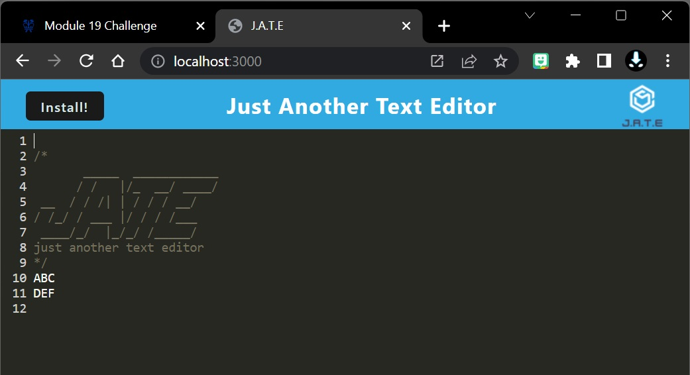
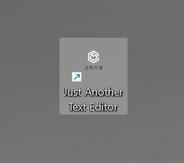
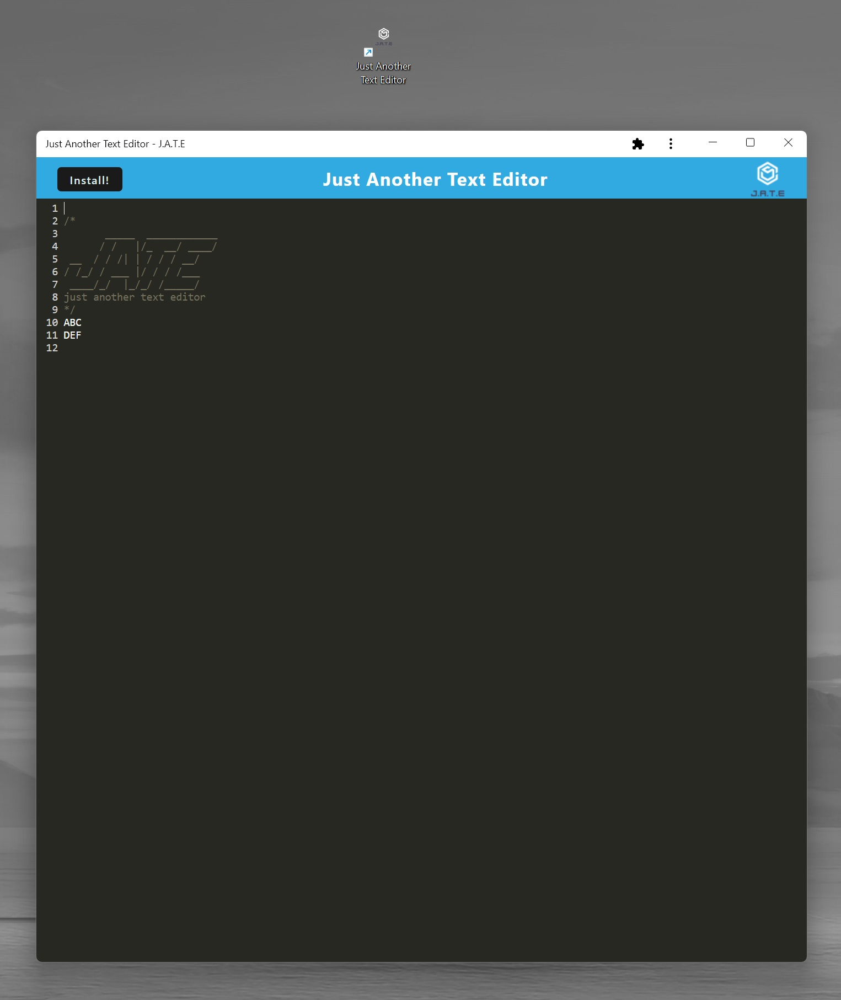

# PWA Text Editor

https://jaxpi.github.io/DEPLOYEDLINK/
 

## Description

This application is a text editor that will store your entered text and automatically stylized to meet the standards of coding.

## Installation

To install, open the application in your browser and click on the black Install! button on the top left of the page. This will create a stand-alone app and it will be automatically added to your desktop.
 
 

## Usage

To use this application simply open it and enter text on the lines. Any time the user clicks outside of the text area the application will automatically save the contents so they will persist even after the text editor is closed.
This application can even be used offline and will sync stored data on the next connection.

## License

MIT License

Copyright (c) 2022 Jackson Impellizeri

Permission is hereby granted, free of charge, to any person obtaining a copy
of this software and associated documentation files (the "Software"), to deal
in the Software without restriction, including without limitation the rights
to use, copy, modify, merge, publish, distribute, sublicense, and/or sell
copies of the Software, and to permit persons to whom the Software is
furnished to do so, subject to the following conditions:

The above copyright notice and this permission notice shall be included in all
copies or substantial portions of the Software.

THE SOFTWARE IS PROVIDED "AS IS", WITHOUT WARRANTY OF ANY KIND, EXPRESS OR
IMPLIED, INCLUDING BUT NOT LIMITED TO THE WARRANTIES OF MERCHANTABILITY,
FITNESS FOR A PARTICULAR PURPOSE AND NONINFRINGEMENT. IN NO EVENT SHALL THE
AUTHORS OR COPYRIGHT HOLDERS BE LIABLE FOR ANY CLAIM, DAMAGES OR OTHER
LIABILITY, WHETHER IN AN ACTION OF CONTRACT, TORT OR OTHERWISE, ARISING FROM,
OUT OF OR IN CONNECTION WITH THE SOFTWARE OR THE USE OR OTHER DEALINGS IN THE
SOFTWARE.
